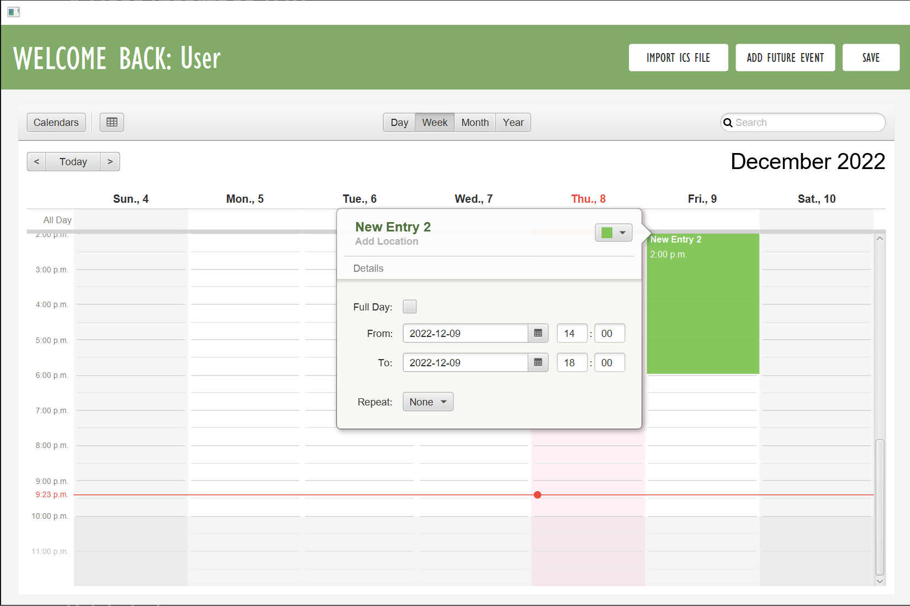
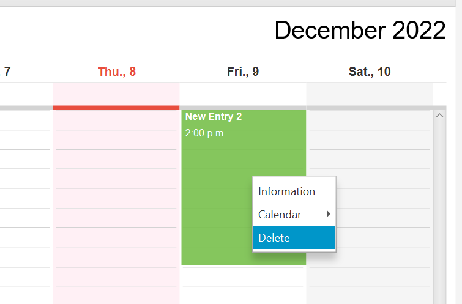

# Schedule 6

SSchedule 6 is a timetable, and task manager application. Users are able to import their calendars, add, edit, and delete events on the timetable. The To-do list enables users to create, edit, and delete tasks.

Students can use this application to enter class schedules, events, and assignments in order to keep track of their tasks. With this program, students are able to access all of their calendar events and tasks from one place and across multiple devices.

# Group members
- Nizar Abdouss([@nizarabdouss](https://github.com/nizarabdouss))
- Steven Li([@stevenli-uoft](https://github.com/stevenli-uoft))
- Selena Wang([@slnwang](https://github.com/slnwang))
- Tammy Wang([@TammyZhuoWang](https://github.com/TammyZhuoWang))
- Mike Wang([@mikewzh418](https://github.com/mikewzh418))
- Tristen White([@Tristenwhite](https://github.com/Tristenwhite))
- Brian Xue([@Bri-xX](https://github.com/Bri-xX))

# Project installation
## Mac User Font Download
Mac users need to download a font in order for the program to display properly. To do so, download the [Gill Sans MT Condensed font](https://www.dafontfree.net/gill-sans-mt-condensed-regular/f64848.htm). To add the font into the system, open Font Book through spotlight search (command + space) and find the plus button to add a new font. This will pull up a Finder window where the downloaded font can be selected and opened. Gill Sans MT Condensed will appear in the “User” section of Font Book

# Running the project
To run our project run `Main` in `src/main/java/main`

# Database
## MongoDB
## Data structure
## Data storage
## Data access

# User Interface (UI)
## User registration and login

On the login page, a first time user would need to register an account by clicking on the registration button, which opens up the registration page.

After an account is created, the user can re-enter their username and password to login.

## Dashboard

After logging in, the dashboard as seen above will show up. This dashboard contains the users timetable and to-do list. The first time a user logs in, both the timetable and to-do list will be empty, but an existing user who already has events and tasks saved, will see those same events and tasks show up on the timetable and to-do list when they log back in.
## Events
Users are able to add events in two ways:
1. While in week view, users can directly click on any time of a day, and drag how long they would want their event to be.
2. Click on the “ADD FUTURE EVENT” button on the top right, and a screen would pop up allowing users to input the required info for an event they want to create (as shown below).

## Import schedule
## Editing and deleting events
To edit an event, user can double click an event on the timetable, and make their required edits to the event, as seen in the screenshot below

## Delete event

## To-do list

## Add task

## Edit task

## Delete task

